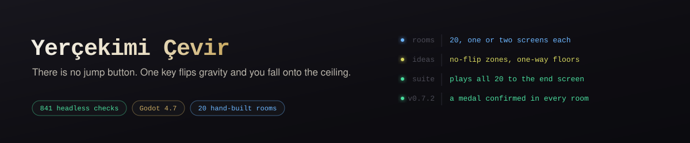
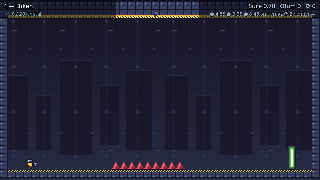

# Yerçekimi Çevir

*No jump button — one key flips gravity and you fall onto the ceiling. 20 hand-built precision platformer rooms (Godot 4, Turkish UI), each one or two screens, with no-flip zones and one-way platforms introduced as separate ideas. 841 headless checks.*

[](https://github.com/Furkiozknn/yercekimi-cevir/actions/workflows/ci.yml)

Zıplama yok: tek tuşla yerçekimini ters çevirip tavana "düşerek" dikenlerden kaçtığın
kısa ve zor bir hassas platform oyunu. **20 bölüm**, her bölüm 1–2 ekran.



<sub>Oyunun kendisinden çekilmiş 3 saniyelik kayıt (`tests/ekran.tscn` kip `-5`, 320×180, 10 kare/sn) — 4. bölüm "Diken".</sub>

**Amaç:** her bölümün sonundaki yeşil **kapıya** ölmeden var. Kapıya varınca
bölüm biter, süren ve madalyan kaydedilir, sıradaki bölüm açılır. Dikene
değmek ya da ekran dışına düşmek öldürür; 0,18 sn sonra bölüm başından (ya da
kontrol noktasından) yeniden başlarsın. Yan hedefler: gizli kristal, madalya
süresi, en az çevirme.

## Nasıl oynarım?

| Yol | Durum |
|---|---|
| **Tarayıcıda (GitHub Pages)** | Henüz yayında **değil**. Web paketi hazır ([Yapi](.github/workflows/yapi.yml) üretiyor), Pages'e ilk yayın depo sahibinin bir kez yapacağı iş. |
| **İndirilebilir paket** | [Releases](https://github.com/Furkiozknn/yercekimi-cevir/releases)'ta henüz ekli dosya yok. GitHub'a giriş yaptıysan [Actions → Yapi](https://github.com/Furkiozknn/yercekimi-cevir/actions/workflows/yapi.yml) altındaki son başarılı koşunun *Artifacts* bölümünden `yercekimi-cevir-windows` ya da `yercekimi-cevir-web` zip'ini indirebilirsin (artifact'lar 90 gün saklanır). |
| **Kaynaktan** | Godot 4.7 ve Git LFS ile — aşağıda [Kaynaktan çalıştır](#kaynaktan-çalıştır). |

Web paketini indirdiysen `index.html`'e çift tıklamak yetmez (tarayıcı
`file://` altında WebAssembly yüklemez); klasörde bir yerel sunucu aç:
`python3 -m http.server 8000`, sonra `http://localhost:8000`.

## Kontroller

| Eylem | Klavye | Gamepad | Dokunmatik |
|---|---|---|---|
| Yürü | `A` / `D` ya da ok tuşları | sol çubuk / D-pad | ekranın sol yarısı |
| **Çevir** | `Boşluk` ya da `W` | `A` | ekranın sağ yarısı |
| Duraklat | `Esc` | `Start` | — |

Çevirme **yalnızca bir yüzeye değerken** çalışır — havada ikinci kez çeviremezsin.
İki yönlü affetme var: yüzeye değmeden ~0,1 sn önce bastıysan sayılır (giriş
tamponu) ve yüzeyden ayrıldıktan sonra da ~0,08 sn hakkın sürer (kojot çevirme).
"Bir kare geç bastım" ölümü bu yüzden yok.

Dokunmatikte küçük düğme aramazsın: ekranın sol yarısı hareket (sol çeyrek sol,
sağ çeyrek sağ), sağ yarısı çevirme. Solak seçeneği tarafları değiştirir —
alan harfleri **ve** ekrandaki ipucu metni de onunla birlikte taraf değiştirir;
düğme opaklığı ve titreşim ayarlardan.

Diken ya da ekran dışına düşmek öldürür; ölünce **0,18 sn** sonra otomatik olarak
bölüm başına — ya da geçtiysen **kontrol noktasına** — dönersin. Sahne yeniden
yüklenmez, hareketli platformlar dahil her şey sıfırlanır. Süre sayacı ölümlerle
sıfırlanmaz, bölüm değişince sıfırlanır.

## Bölümde ne var

- **Gizli kristal** (her bölümde 1). Her zaman ana rotanın dışında: genelde tavanda,
  zeminde yürürken kaçamak yapman gereken bir yerde. Toplanınca kalıcı kaydedilir.
- **Madalya süreleri.** Her bölümün altın / gümüş / bronz hedefi var; arayüzün sağ
  üstünde yazıyor, en iyi madalyan Bölüm Seç'te görünüyor. Hedefler **formülden
  değil ölçümden**: bir bot 20 bölümün hepsini gerçek fizikte, bölüm başına
  5 kez oynuyor (her karara 0,05–0,20 sn tepki gecikmesiyle) ve eşikler o
  koşuların ortancasından çıkıyor. Çarpanlar (altın ×1,35, gümüş ×1,75,
  bronz ×2,40) aynı botun **insan tepki bandında** (0,18–0,35 sn) yeniden
  koşturulmasıyla gerekçeli: altın, insan tepkisiyle ölümsüz doğru hattın süresi.
- **Kontrol noktası.** 64 sütunluk uzun bölümlerin ortasında bir mavi direk;
  ona değdikten sonra ölünce oraya dönersin.
- **"En az çevirme" ikinci hedefi.** Süreden bağımsız: her bölümün kaç çevirmeyle
  çözülebileceği **ölçülmüş** (botun gerçekten bitirdiği en az çevirme sayısı),
  senin en iyi çevirme sayın kaydediliyor. Hızlı bitirmek ve az çevirmek iki ayrı oyun.
- **Hayalet yarış.** O bölümdeki en iyi koşun yarı saydam olarak yanında koşar;
  rengi o koşunun madalyası — altın koşu altın hayalet.
- **Altın hayalet.** Botun ölçülmüş en iyi koşusu ayrı bir yarış hedefi olarak
  koşar. Kendi hayaletinle karışmasın diye ikisi de etiketli ("sen" / "altın") —
  renk yetmiyor, çünkü altın madalyan varsa senin hayaletin de altın renkte olur.
  Ayarlardan kapatılır.
- **Ölüm haritası.** Bölüm bitince bölümün küçültülmüş planı ve öldüğün her nokta
  X ile. "Burada takılıyorsun" demenin en kısa yolu.
- **Günün bölümü.** Ana menüden: tarihten seçilen bir bölüm + küçük bir
  değiştirici — **ters başlangıç** (tavandan doğarsın; kontrol noktasından
  dönüş normal), **kristal zorunlu** (kapı kristal alınmadan açılmaz;
  kristal ana oyunda toplanmış olsa da o gün yeniden yerinde) ya da
  **hayalet yarışı** (botun ölçülmüş altın hayaleti rakiptir; kapı yalnız
  ondan önce varılınca sayılır, geç kalırsan "hayalet kazandı" ve bölüm
  baştan). Aynı gün herkes aynı bölümü oynar. Kaydı **ayrı**: günün en iyi
  süresi menüde yazar, gün değişince sıfırlanır; madalya, hayalet, kristal
  sayacı ve açılan bölüm **değişmez**. Kendi hayaletin günlük modda kapalı
  (normal başlangıcın kaydı, ters başlangıçta yalan söyler).
- **Seri ve paylaşım.** Günün bölümünü ardışık günlerde bitirirsen seri büyür
  ("seri 3 gün" menüde yazar); bir gün atlarsan sonraki bitiş 1'den başlatır.
  Bitişte açılan panel bölüm adı, değiştirici, süre, ölüm, çevirme ve seriyi
  üç satırlık bir metin olarak gösterir; **Paylaşım Metnini Kopyala** panoya
  alır (web'de de çalışır — kopyalama bir düğmeye bağlı, çünkü tarayıcı panoya
  yazmayı yalnız kullanıcı dokunuşunda kabul eder).
- **Bölüm grubu müziği.** 1–7 sakin, 8–14 gergin, 15–20 hızlı; üçü de
  `tools/muzik_uret.gd` ile üretilmiş döngüler, menü müziği ayrı. Grup
  değişmediyse parça bölüm geçişinde kesilmez.
- **Kapı ve kristal parıldar.** Dört kareli sayfalar (`tools/uret_sprite.py`),
  0,15 sn'de bir kare; HUD ve menüdeki kristal simgesi tek kare kalır.
- **Çevirme yasağı bölgesi** (v0.7). Yüzeye bitişik, kesik çizgili turuncu kutu ve
  ortasında kilit: içindeyken yerçekimi çevrilemez, basılan tuş yutulur (bölgeden
  çıkınca "kendiliğinden" çevirme olmaz), üstte **ÇEVİRME KİLİTLİ** rozeti ve kısa
  kilit sesi. Bölge yalnız kendi yüzeyini bağlar: zemindeki kutunun üstünde tavanda
  yürüyen serbesttir. 9 — Salıncak'ta dikenin hemen önünde (kararı kutuya girmeden
  vermelisin), 16 — Kılçık'ta tavanda (altındaki dikeni geçerken inemezsin) ve
  zeminde. Üreteç kuralı: bölgenin yüzeyinde ölümcül engel olamaz.
- **Tek yönlü platform** (v0.7). Oklu gri karo: oklar hangi yöne bakıyorsa o yönde
  içinden geçilir, öbür yandan gelince tutar. `_` üstüne inilir (yerçekimi aşağı),
  alttan geçilir; `~` altına inilir (yerçekimi yukarı), üstten geçilir. Katı yüz
  sabittir, yerçekimiyle dönmez — aynı platform iki yerçekiminde farklı davranır.
  14 — Boşluk Üstü'nde altında delik, üstünde tavan dikeni olan bir `~` köprü (tek
  yol platformun altında yürümek, sonra zemine çevirmek); 20 — Son Kapı'nın son
  deliğinde `_` (tavandan düşüp üstüne inersin, kapıya yürürsün). İniş göstergesi ve
  bot ikisini de görür.
- **Bölüm başı tabelası** (v0.7). Bölüm yüklenince 1,2 sn "N — Ad · altın X sn ·
  en iyi Y sn" kartı; ilk girdiyle kapanır, süre sayacı durmaz.
- **Süre listesi** (v0.7). Bölüm Seç'te **Süre Listesi** düğmesi 20 bölümü iki
  sütunlu listeye çevirir: ad, en iyi süren, madalyan, altın hedefi. Menüde toplam
  madalya sayısı.
- **Bitiş özeti.** 20. bölüm bitince oyun toplamı tek ekranda: toplam süre,
  toplam ölüm, kristal, madalya kazanılan bölüm ve en az çevirmeyle biten bölüm
  sayısı; ayrı bir bitiş parçası çalar.

## Okunurluk ve yardım

- **Oda tabanlı kamera.** Kamera seni izlemez, 640 px'lik odalar arasında atlar.
  Bir odadaki tehlikenin tamamı hep ekrandadır; ekran dışından gelen ölüm yok.
- **Üst HUD şeritleri solar.** Tavanda yürürken sen (ya da bir hayalet) üst
  şeridin dikdörtgenine girince o şerit yazılarıyla birlikte 0,15 sn'de
  %25 opaklığa iner, çıkınca geri gelir; girdiye dokunmaz.
- **Yerçekimi oku.** Yanındaki küçük ok hangi yöne çekildiğini gösterir —
  durum renkten değil biçimden okunur.
- **İniş göstergesi.** Çevirme tuşunu basılı tutarsan karşı yüzeyde nereye ineceğin
  işaretlenir; yolda diken varsa işaret kırmızıya döner. **Hareketli platformları
  ve gezen dikenleri sayar** ve onları geçiş süresi kadar ileri sarar: geçiş
  ~0,9 sn sürüyor, o sürede platform 42 px yol alıyor, yani "şu an altımda"
  ile "indiğimde orada olacak" aynı şey değil.
- **Yüksek kontrast** seçeneği tehlikeleri parlatır, zemini ve arka planı geri çeker.
- **Yardım modu.** Oyun hızı %50–100, dikenler öldürmek yerine iter, duraklatma
  menüsünden bölüm atlanır. Açıkken süre, madalya ve çevirme kaydı tutulmaz;
  kristaller sayılır. İstediğin an kapatılır.

## Lisanslar

Kod ve varlıklar [MIT](LICENSE) altında — Furki Özkan, 2026; görseller, sesler
ve müzik depodaki üreteclerle koddan üretilir. `assets/fonts/simgeler.ttf` ("Oyun Simgeleri")
DejaVu Sans Bold'un 32 simgelik alt kümesidir; Bitstream Vera lisansı altında
dağıtılır, bildirim `assets/fonts/LISANS-simgeler.txt` dosyasındadır.

## Ekranlar

| | |
|---|---|
|  |  |
|  |  |

Hepsi `tests/ekran.tscn` ile oyunun kendisinden çekildi (1280×720); sürüm
sürüm özellik kareleri `docs/tur*/` altında.

## Platform ve performans

- **Hedefler:** Windows (`Windows Masaustu`) ve Web (`Web (HTML5)`) —
  `export_presets.cfg`'de tanımlı iki ön ayar. Linux/macOS/Android paketi yok;
  kaynaktan her masaüstü sistemde Godot 4.7 ile açılır.
- **Girdi:** klavye, gamepad, dokunmatik (tarayıcıda telefon dahil).
- **Renderer:** GL Compatibility — tümleşik GPU (Intel UHD sınıfı) hedefleniyor,
  web'de de tek yol. Taban çözünürlük 640×360, pencere 1280×720, pixel art
  `nearest` filtreyle.
- **Web yapısı tek iş parçacıklı** (`thread_support=false`): COOP/COEP başlığı
  ya da SharedArrayBuffer gerekmez, sıradan bir statik sunucu yeter.
- **Paket boyutları** — Yapi koşusunun kendi günlüğünden (22 Eylül 2026,
  Godot 4.7.2):

  | | açılmış | artifact zip |
  |---|---|---|
  | Web | 39 MB — `index.wasm` 39.514.754 bayt (motor), `index.pck` 830.332 bayt (oyunun kendisi) | 10,9 MB |
  | Windows | 105 MB — `.exe` 109.147.136 bayt, `.pck` 830.332 bayt | 39,6 MB |

  Web'de ilk açılışın ağırlığı neredeyse tamamen motorun `.wasm`'ı; oyunun
  kendi verisi 1 MB'ın altında.
- **Kare hızı ölçülmüş bir değer değil:** depoda FPS ölçümü yok, bu yüzden
  burada bir sayı yazılmıyor. Fizik 60 Hz; bot denetimi `--fixed-fps 60` ile koşuyor.

## Kaynaktan çalıştır

Gerekenler: **Godot 4.7** (CI 4.7.2-stable kullanıyor), **Git LFS**
(tüm `.png` / `.wav` / `.ttf` / `.gif` LFS'te).

```bash
git lfs install                       # bir kez, makine başına
git clone https://github.com/Furkiozknn/yercekimi-cevir.git
cd yercekimi-cevir
git lfs pull                          # LFS kancası kurulu değilken klonladıysan
godot --headless --path . --import    # bir kez: .godot önbelleğini kur
godot --path .                        # oyunu aç (ana sahne: menü)
```

LFS olmadan klonlarsan görseller ve sesler ~130 baytlık metin işaretçileri
olarak gelir ve Godot sahneleri "bozuk kaynak" diye açamaz. Kontrol:
`file docs/01-menu.png` → `PNG image data` demeli, `ASCII text` değil.

İçe aktarma ayrı adım, çünkü taze bir klonda `.godot` önbelleği yok; onsuz
oyunla ilgisiz ayrıştırma hataları çıkar (CI da aynı sırayla koşuyor).

### Elle duman testi (2 dakika)

Yeni bir yapıyı ya da bir değişikliği elle doğrulamanın en kısa yolu:

1. Menü açılıyor, menü müziği çalıyor; **Başla** açılmış en yüksek bölümü
   başlatıyor (temiz bir kayıtta 1. bölüm).
2. `A`/`D` ile yürü, `Boşluk` ile çevir: karakter tavana düşüyor, yanındaki
   yerçekimi oku yön değiştiriyor. Havadayken ikinci çevirme **olmuyor**.
3. Bir dikene bilerek değ: kısa bir an sonra bölüm başındasın; süre sayacı
   sıfırlanmıyor, sağ üstteki ölüm sayacı artıyor.
4. Kapıya var: "BÖLÜM TAMAM" mesajı süre ve madalyayla çıkıyor, öldüğün
   yerler ölüm haritasında X ile; menüye dönünce Bölüm Seç'te 2. bölüm açık.
5. `Esc` oyunu duraklatıyor, tekrar basınca devam ediyor.

Otomatik karşılığı aşağıda [Test ve CI](#test-ve-ci)'de: 841 doğrulama +
20 bölümü gerçekten oynayan bot.

### Geliştirici komutları

```bash
godot --headless --path . res://tests/testler.tscn    # otomatik testler (çıkış kodu 0 = geçti)
godot --path . res://tests/ekran.tscn -- 2 <klasör>   # 3. bölümü sürüp ekran görüntüsü al
godot --path . res://tests/ekran.tscn -- -1 <klasör>  # menü / bölüm seç / ayarlar
godot --path . res://tests/ekran.tscn -- -2 <klasör>  # yayın paketi görselleri + kapak
godot --path . res://tests/ekran.tscn -- -3 <klasör>  # v0.3 özelliklerinin denetim kareleri
godot --path . res://tests/ekran.tscn -- -5 <klasör>  # 3 sn tanıtım kareleri (GIF için ham veri)
godot --path . res://tests/ekran.tscn -- -7 <klasör>  # v0.6: HUD solması, hayalet yarışı, paylaşım, parıltı
godot --path . res://tests/ekran.tscn -- -8 <klasör>  # v0.7: yasak bölge, tek yönlü platform, tabela, süre listesi

python3 arac/uret_bolumler.py       # 20 bölümü yeniden üret (çözülebilirliği doğrular)
python3 tools/uret_sprite.py        # tüm pixel art'ı yeniden üret (yalnız standart kütüphane)
python3 tools/uret_ses.py           # ses efektlerini yeniden üret — rFXGen v5.0 gerekir, bkz. alt not
python3 tools/gif_yap.py --dogrula  # GIF kodlayıcısının öz denetimi
```

İki Python üreticisi deterministik: `uret_bolumler.py` ve `uret_sprite.py`
temiz bir klonda çalıştırıldığında `git status` boş kalıyor — depodaki
`scripts/bolumler.gd` ve `assets/sprites/*.png` bayt bayt onların çıktısı.
`uret_ses.py` ise depoda olmayan **rFXGen v5.0**'ı çağırıyor; yolunu `RFXGEN`
ortam değişkeniyle ver, yoksa betik `rFXGen bulunamadi` yazıp 1 ile çıkar.
Müzik ayrı: `tools/muzik_uret.gd` (Godot içinde).

### Dışa aktarma

Çıktılar `build/` altına yazılır ve depoda tutulmaz (`.gitignore`). Dışa
aktarma şablonları (4.7.2) kurulu olmalı; komutlar Yapi iş akışındakiyle aynı:

```bash
mkdir -p build/windows build/web
godot --headless --path . --export-release "Windows Masaustu" "build/windows/yercekimi-cevir.exe"
godot --headless --path . --export-release "Web (HTML5)" "build/web/index.html"
```

Ön ayar adları `export_presets.cfg`'deki gibi **aksansız** yazılmalı.

### Godot kurmadan paket üretmek (depo sahibi)

**Yapi** iş akışı yalnızca elle tetiklenir (Actions → Yapi → *Run workflow*;
depoya yazma yetkisi gerekir). Sabit Godot 4.7.2-stable ile Windows ve Web
paketlerini üretip *Artifacts* altına bırakır. Varsayılanı hiçbir şey
yayımlamamaktır. Oynayıp "yayınlanabilir" dediğinde aynı pencerede
**`sayfaya_yayinla`** kutusunu işaretlemen yeterli: o zaman web paketi GitHub
Pages'e gider ve oyun tarayıcıdan oynanır hâle gelir. Kutu işaretlenmedikçe
Pages'e dokunulmaz.

İlk yayından önce Pages'in depoda **bir kez elle** açılması gerekiyor:
Settings → Pages → Source: **GitHub Actions**. İş akışının kendi anahtarı
Pages sitesi oluşturamıyor; açılmamışsa yayın adımı "Resource not accessible
by integration" hatasıyla durur.

itch.io paketi hazır ama yüklenmedi: `yayin/`.

## Kod düzeni

| Dosya | İş |
|---|---|
| `scripts/ayarlar.gd` | **Tüm denge sabitleri** + ilerleme kaydı + oyuncu ayarları. Ayar yapacaksan tek durak. |
| `scripts/ses.gd` | Efekt havuzu ve müzik (autoload); bölüm grubuna göre parça seçimi. Ses düzeyi AudioServer veriyolunda. |
| `scripts/bolumler.gd` | 20 bölüm, ASCII harita olarak. `arac/uret_bolumler.py` üretir. |
| `scripts/bolum.gd` | ASCII haritayı çalışma anında çarpışma gövdesi + pixel art çizime çevirir. |
| `scripts/oyuncu.gd` | Çevirme mekaniği (tampon + kojot), yerçekimi oku, ölüm, esneme-sıkışma. |
| `scripts/oyun.gd` | Bölüm döngüsü, oda kamerası, hayalet, ölüm haritası, iniş göstergesi, yardım modu. |
| `tools/` | Varlık üreticileri (pixel art, ses) + `sesler.md`. |
| `tests/` | Headless otomatik test (841 doğrulama) + ekran görüntüsü aracı. Eşiklerin hâlâ doğru olup olmadığını `tools/bot.gd --  ... denetle` soruyor. |

Bölüm haritaları TileMapLayer yerine ASCII + kod üretimi: 20 bölüm tek dosyada
düzenlenebiliyor ve `arac/uret_bolumler.py` üretim sırasında her bölümün
çözülebilirliğini doğruluyor — çevirme penceresi yeterince geniş mi, aynı sütunda
hem zemin hem tavan tehlikesi var mı, kristal kaçamağı ölümcül mü.

## Durum

**Son sürüm: v0.7.2** (22 Eylül 2026) — v0.7'nin oynanışı + MIT lisans, her
push'ta CI, belge düzeltmeleri. v0.7 çevirme yasağı bölgesi, tek yönlü
platform, bölüm başı tabelası, süre listesi ve kol sallanmasını getirdi.

Sürüm sürüm ne değişti ve **neden öyle karar verildi** (zorluk eğrisi, haksız
ölüm, madalya eşiklerinin ölçümle belirlenmesi, solak düzen, günün bölümü…):
[CHANGELOG.md](CHANGELOG.md). Yayımlanmış notlar
[Releases](https://github.com/Furkiozknn/yercekimi-cevir/releases)'ta,
sonraki adımlar [YOL-HARITASI.md](YOL-HARITASI.md)'de.

İlerleme ve ayarlar `user://kayit.cfg` dosyasında (Windows'ta
`%APPDATA%\Godot\app_userdata\Yerçekimi Çevir\kayit.cfg`).

## Bilinen sınırlar

Hepsi ölçüldü veya yapılandırmadan doğrulandı — tahmin yok.

- **Yalnızca Windows ve Web paketi.** Linux, macOS ve Android dışa aktarımı
  yok (bkz. [Platform ve performans](#platform-ve-performans)).
- **Canlı demo henüz yok.** Pages yayını ve Releases'a paket ekleme depo
  sahibinin elle yapacağı işler (bkz. [Nasıl oynarım?](#nasıl-oynarım)).
- **Arayüz yalnızca Türkçe.** `project.godot` içinde çeviri/locale girdisi
  bulunmuyor; metinler sahnelere ve betiklere doğrudan gömülü
  (`scenes/*.tscn` + `scripts/*.gd`), çeviri katmanı yok.
- **itch.io'ya yüklerken SharedArrayBuffer kutusu işaretlenmemeli** — web
  yapısı tek iş parçacıklı (`thread_support=false`).
- **Bölüm başı ipucu metni bölümün üzerine biniyor.** Ekranın ortasında,
  üstten 96 px'te duruyor (`scenes/oyun.tscn` → `Ipucu`); HUD şeritlerinin
  (y 0–39) altında kalıyor ama haritanın 5-6. satırındaki karoların üzerine
  çizilebiliyor. Okunuyor, oynanışı engellemiyor — kozmetik.
- **İlerleme tek makinede.** Kayıt yerel; bulut senkronu yok, dosya
  silinirse tüm bölüm ve madalya ilerlemesi sıfırlanır.

## Test ve CI

```bash
godot --headless --path . --import                    # bir kez, .godot onbellegi
godot --headless --path . res://tests/testler.tscn    # cikis kodu 0 = gecti
```

`main`'e her push'ta ve her pull request'te **aynı komut** GitHub Actions'ta
koşuyor (Godot 4.7.2, Linux
headless, Git LFS çekilerek). Son ölçüm: **841 doğrulama, 0 hata**.

**Bir de bot koşuyor.** Madalya eşikleri `scripts/rota_verisi.gd` içinde duruyor
ve 841 doğrulamanın ilgili kısmı onları o dosyaya karşı sınıyor — yani dosyayı
kendisine karşı. Bir bölümün haritası değişirse dosya eski kalır, testler yine
yeşil yanar, ve bölüm çözülemez ya da altın ulaşılamaz hale gelmiş olabilir.
Bunu görebilecek tek şey botu yeniden koşturmaktır; bot zaten `tools/bot.gd`
içinde duruyordu, yalnızca CI'da hiç koşmuyordu. Artık her push'ta **20 bölüm ×
3 koşu** (yaklaşık 6 sn) koşuyor ve iki şeyi soruyor: her bölüm hâlâ bitiyor mu,
ve yayımlanan altın eşiği botun bugünkü ortancasından büyük mü. Denetim dosya
yazmaz — yazsaydı CI'da üretilen bir eşik sessizce doğru sayılırdı — ve ayrı bir
adım çalışma ağacının temiz kaldığını doğruluyor.

```bash
godot --headless --path . res://tools/bot.tscn --fixed-fps 60 -- 3 -1 - denetle
```

İçe aktarma ayrı bir adım çünkü taze bir klonda `.godot` önbelleği hiç
yok; onsuz testin içeriğiyle ilgisi olmayan ayrıştırma hataları alınır.

---


### Kırık kaynak referansları

Bir oyunda en geç fark edilen kusur, kırık bir kaynak referansıdır: silinmiş
bir `.png`, taşınmış bir `.tscn`, adı değişmiş bir `.tres`. Motor bunu her
zaman açılışta söylemez — sahne o kod yolu çalışana kadar sessiz kalabilir,
yani testler yeşilken de orada durabilir.

CI'da ayrı bir iş bunu arıyor: aynı hesaptaki
[godot-refcheck](https://github.com/Furkiozknn/godot-refcheck), motoru
indirmeden projeyi tarıyor ve bulguları SARIF olarak kod taramaya yüklüyor.
Şu an temiz: **253 dosya, 75 referans, sıfır bulgu** (CHANGELOG.md eklendikten sonra; dosya sayısı depoyla birlikte değişir, bulgu sayısının sıfır kalması kapı).

## Bu ekosistemden başka projeler

- **[tek-tus-kosu](https://github.com/Furkiozknn/tek-tus-kosu)** — tek tuş, müziğin vuruş ızgarasına dizilmiş engeller
- **[derin-kazi](https://github.com/Furkiozknn/derin-kazi)** — kaz, sat, geliştir; asıl sayaç yakıt
- **[kanca](https://github.com/Furkiozknn/kanca)** — tavana kanca at, salın, tam zamanında bırak
- **[godot-refcheck](https://github.com/Furkiozknn/godot-refcheck)** — Godot projelerindeki kırık referansları ve ölü sinyalleri bulur, onarır

<sub>Hepsi tek bir aranabilir sayfada: **[furkiozknn.github.io](https://furkiozknn.github.io/)** — her kart, o deponun kendi <code>project-meta.json</code> dosyasından üretiliyor.</sub>
